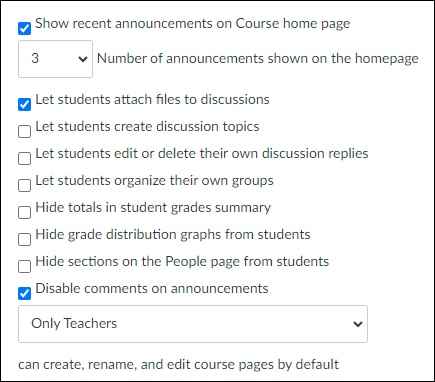
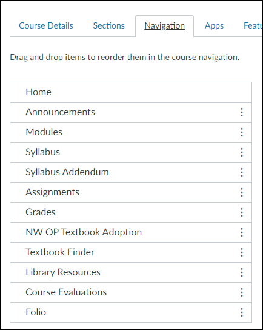

# Start New Term

Process when new courses become available. 

-----

## Star All Future Course Sections

Go to Canvas / Courses / All Courses.

In the list, star all the new upcoming course sections. 

## Dashoard - Organize by Term

Go to Canvas / Dashboard.

Arrange first by term, then by course number. 

Put the main section first. 

-----

## Cross-List Sections

Go to any repeat sections that you want to combine with the main section of that course / term.

Course / Settings / Section / "Cross List this Section"

Mouse over the main section on the dashboard to get course number. Use this id number to find the main section and cross list. 

## Update Main Section Settings to Reflect All Sections

Change the course name and id to reflect all sections now in this one main site. 

-----

## Import Prior Content

First, identify the prior content you want to import. 

Go to PRIOR Course / Settings / Course Details tab:

- Find the course id or name to start with. 
- Find the prior course start date (and end date if different length) 

Now, go to the new empty course you want to populate. 

Go to NEW Course / Settings / Course Details tab. 

- Find the new course start date (and end date if different length)

Click "Import from existing course" and provide the information to adjust the dates. 

-----

## Settings

Course / Settings / Course Details tab.

- Restrict from viewing before start date (or provide date)
- Set grading scale
- Show 3 announcements
- Can attach files
- Restrict comments on announcements

Course / Settings / Navigation tab. 

Generally in this order. Details change by course. 

-----

## Module 0

Module 0 is for all the syllabus and course required information. 
Having them mark "Done" on each page is a way to help students see critical information about required textbooks, course policies, prerequesities and more. 
Remaining modules are given just this Module 0 as a prereq - once all Module 0 pages have been reviewed and marked "Done", the full course is available.

Name activities by skill whereever possible.

Add "& Engage" in the name if interaction is required. 

Make most pages a discussion with at least a couple points. 

Students care most about assignments and it helps them encounter critical overview and lecture content pages. 
